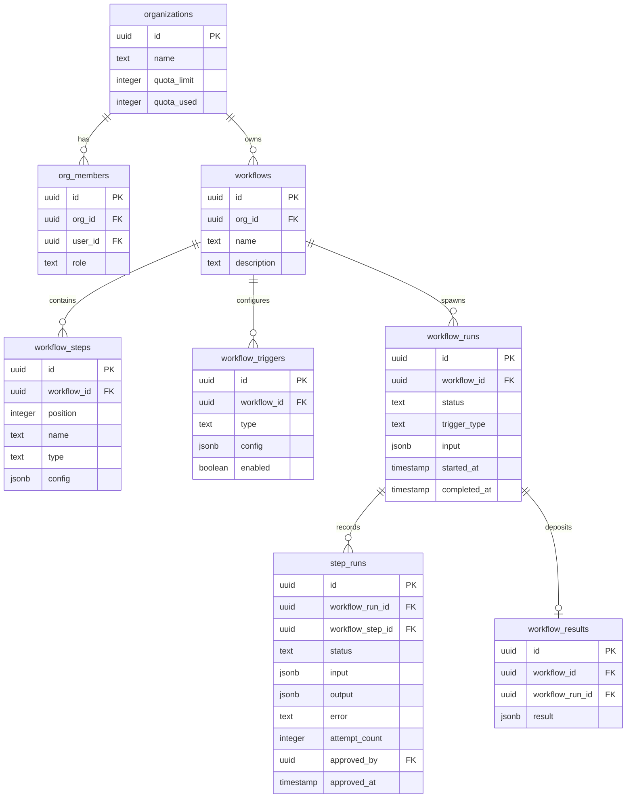
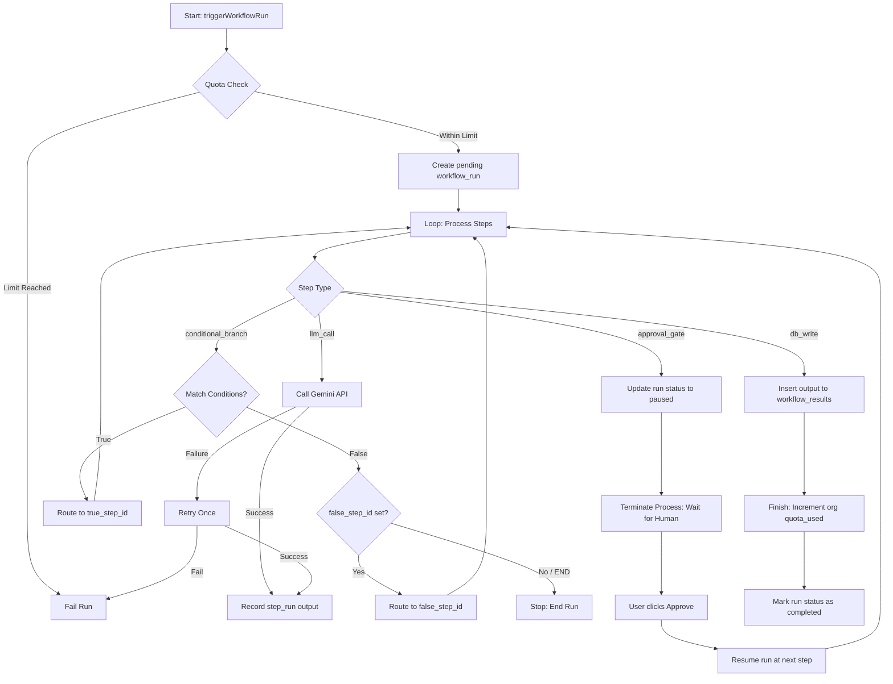
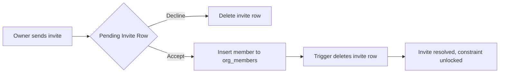
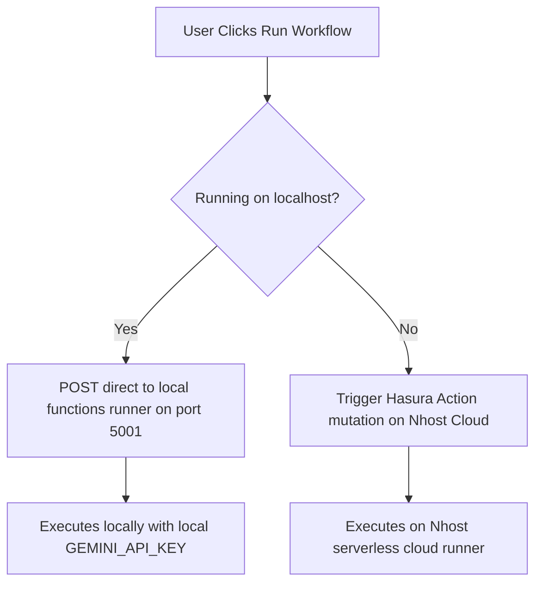

# 🏗️ System Architecture - AI Agent Workflow Builder (Mini-n8n)

This document provides a technical overview of the design, database schema, security models, execution pipelines, and workflow dynamics of the Mini-n8n platform.

---

## 1. Overall System Architecture

The following block diagram outlines the component layout, user client interfaces, serverless API executors, database managers, and third-party AI interfaces:

```mermaid
graph TD
    subgraph Client Panel (Localhost:3000)
        A[Next.js Frontend] -->|Apollo HTTP Client| B(Hasura GraphQL Engine)
        A -->|WebSocket Subscription| B
        A -->|Bypass local dev triggers| C(Local Functions Runner: 5001)
    end

    subgraph Nhost Cloud Environment
        B -->|Triggers webhook Actions| D(Cloud Serverless Functions)
        B -->|Read / Write state| E[(PostgreSQL Database)]
        D -->|Execute GraphQL Mutations| B
        C -->|Execute Admin Queries| B
    end

    subgraph Third-Party integrations
        D -->|API Calls| F[Gemini AI / External Webhooks]
        C -->|Local API Calls| F
    end
```

---

## 2. Database Entity-Relationship Diagram (ERD)

This entity-relationship layout maps the metadata tables, organizational user structures, and step tracking execution models:



---

## 3. Core Workflow Execution Flow

The following Mermaid diagram visualizes the life cycle of a workflow execution, from the initial trigger and quota validation to AI step evaluation, conditional branching, human-in-the-loop approval, and database archival:



---

## 4. Organization Invitation Lifecycle

To maintain strict organization database isolation and avoid database lockups or duplicate key conflicts on the `(org_id, invited_user_id)` unique constraint, we employ a clean **ephemeral invitation lifecycle**:



*   **Constraint Lock Prevention**: Storing accepted/declined rows long-term blocks future invitations if a user leaves and rejoins an organization. Deleting resolved invitations clears the constraint block cleanly.
*   **Database Trigger**: The `process_org_invite_acceptance()` trigger runs as superuser after status is updated to `'accepted'`, inserting the row into `org_members` and deleting the source invite row automatically.

---

## 5. Local Development Webhook Bypass

For seamless local debugging without exposing localhost ports using tunneling tools, the frontend dynamically routes execution triggers depending on the environment:



*   **CORS Enabled**: The local runner `scripts/functions-runner.ts` is configured with wildcard CORS headers to accept cross-origin requests from the Next.js local server on port 3000.

---

## 6. Technical Specifications

### 📊 Database Schema Design
We use PostgreSQL (hosted on Nhost Cloud) with UUID keys. The schema centers around strict workflow definition and audit-trail tracking:
*   `organizations` & `org_members`: Define organizational bounds. Users map to memberships with roles: `owner`, `editor`, or `viewer`.
*   `workflows`, `workflow_steps`, & `workflow_triggers`: Declare the workflow pipeline, sequential steps, and entry trigger points (e.g. manual, webhook).
*   `workflow_runs` & `step_runs`: Audit-trail tracking of executions, capturing inputs, outputs, errors, attempts, and approval gates.
*   `workflow_results`: Target table populated by the `db_write` step.
*   **Performance**: Explicit indexes are placed on all foreign keys (`org_id`, `workflow_id`, `workflow_run_id`, etc.) to optimize query speeds.

### 🔒 Security & Organization Isolation
Security is enforced at two distinct layers:
1.  **Hasura Row-Level Permissions**: Hasura evaluates the authenticated user's ID (`X-Hasura-User-Id` header). A user can only perform SELECT, INSERT, UPDATE, or DELETE if they belong to the corresponding organization:
    *   `workflow.organization.members.user_id = X-Hasura-User-Id`
2.  **Role and Step-Level Gating**:
    *   Editors/Viewers cannot add or modify `db_write` / `notify` steps or `webhook` triggers. This is restricted on the database via row-level permission constraints: `type` must not be in the restricted set unless the user's member role is `owner`.
    *   **Action Handlers**: Crucial operations (like `approveStep` and `triggerWorkflowRun`) execute via serverless functions (Hasura Actions) where we perform authorization checks on the server using admin-level database context.

### 🧠 Workflow Executor & Retries
The execution engine is a modular TypeScript class (`functions/shared/executor.ts`):
*   **Safe Expressions**: To route branches safely without security exploits, `conditional_branch` uses a pure data-driven condition evaluator comparing fields, operators (e.g., `equals`, `contains`), and target values. `eval()` is never used.
*   **HTTP Native Fetch**: External requests use the native Node `fetch` API.
*   **Automatic Retries**: External steps (`llm_call` and `http_request`) catch failures and retry exactly once. The attempt count is saved in the database.
*   **Exiting/Pausing**: When execution hits `approval_gate`, status is updated to `paused` and the Node process terminates. Upon approval, the Action handler triggers the executor with a `resumeFromStepId` flag, which skips all completed steps and continues immediately from the next step.

### ⏱️ Quota Management
Organizations have strict quota boundaries (`quota_limit`). 
*   **At Start**: The executor checks if `quota_used >= quota_limit`. If exceeded, execution is immediately failed.
*   **Successful Completion**: To prevent fraud or waste, quota is only incremented *after* the workflow run finishes executing its final step successfully.
